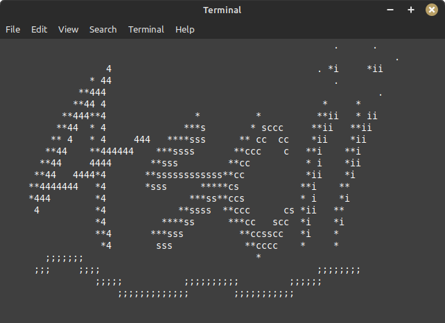

# 4scii - ASCII art with the mouse in the terminal

### Grab the source
```
git clone https://github.com/aladrin/4scii.git
cd 4scii
```
### OpenBSD
```
cc -O2 -pipe -c 4scii.c
cc -o 4scii 4scii.o -lcurses
```

### Ubuntu
```
sudo apt install -y ncurses-dev
gcc -O2 -pipe -c 4scii.c
gcc -o 4scii 4scii.o -lncurses
```
### Usage
```
./4scii
Press any key to change brush
Ctrl-s save 4scii.txt and quit
Ctrl-q just quit
```
